<!-- Assets in assets/ are generated by scripts/build.py -->

<a href="https://moosamemon.me">
  <picture>
    <source media="(prefers-color-scheme: dark)" srcset="assets/hero-dark.svg">
    
  </picture>
</a>

  <a href="https://moosamemon.me"><picture><source media="(prefers-color-scheme: dark)" srcset="assets/btn-website-dark.svg"></picture></a>
  <a href="https://www.linkedin.com/in/moosamemon/"><picture><source media="(prefers-color-scheme: dark)" srcset="assets/btn-linkedin-dark.svg">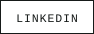</picture></a>
  <a href="https://x.com/moosamemonn"><picture><source media="(prefers-color-scheme: dark)" srcset="assets/btn-x-dark.svg">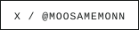</picture></a>
  <a href="mailto:notmoosamemon@gmail.com"><picture><source media="(prefers-color-scheme: dark)" srcset="assets/btn-email-dark.svg">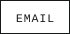</picture></a>
  <a href="https://moosamemon.me/contact/"><picture><source media="(prefers-color-scheme: dark)" srcset="assets/btn-call-dark.svg"></picture></a>

**AI Automation Engineer at UnitZero** since September 2025. BS in Artificial Intelligence from FAST-NUCES, Karachi. Based in Karachi, working US hours.

I build retrieval pipelines that answer from messy internal documents, agent workflows that do multi-step work without babysitting, and the automation infrastructure that connects both to the tools a business already runs on. The day job stays private. Everything below I designed and shipped end to end on my own time.

## Selected systems

Each row links to the case study on [moosamemon.me](https://moosamemon.me/work/). The repos are private, so the write-ups are the public record. Numbers appear only where they were measured.

<a href="https://moosamemon.me/work/customer-ops-agent/"><picture><source media="(prefers-color-scheme: dark)" srcset="assets/row-customer-ops-agent-dark.svg">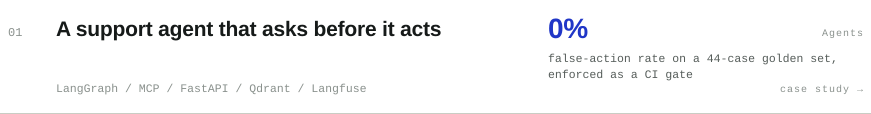</picture></a>
<a href="https://moosamemon.me/work/fintex/"><picture><source media="(prefers-color-scheme: dark)" srcset="assets/row-fintex-dark.svg">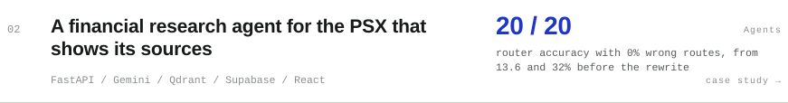</picture></a>
<a href="https://moosamemon.me/work/beachhead/"><picture><source media="(prefers-color-scheme: dark)" srcset="assets/row-beachhead-dark.svg">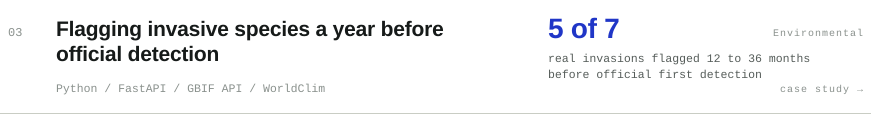</picture></a>
<a href="https://moosamemon.me/work/autopricer/"><picture><source media="(prefers-color-scheme: dark)" srcset="assets/row-autopricer-dark.svg">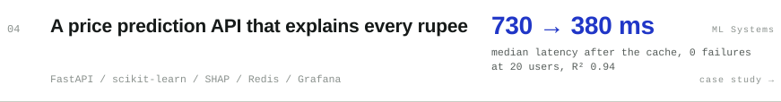</picture></a>
<a href="https://moosamemon.me/work/verify-bridge/"><picture><source media="(prefers-color-scheme: dark)" srcset="assets/row-verify-bridge-dark.svg">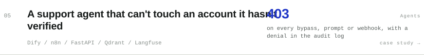</picture></a>
<a href="https://moosamemon.me/work/ops-relay/"><picture><source media="(prefers-color-scheme: dark)" srcset="assets/row-ops-relay-dark.svg">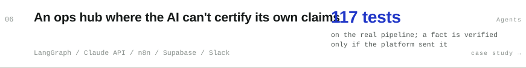</picture></a>
<a href="https://moosamemon.me/work/converse-iq/"><picture><source media="(prefers-color-scheme: dark)" srcset="assets/row-converse-iq-dark.svg">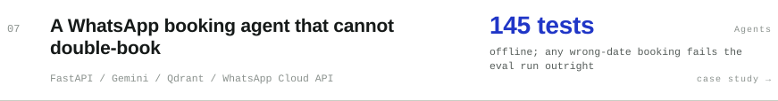</picture></a>
<a href="https://moosamemon.me/work/doclens/"><picture><source media="(prefers-color-scheme: dark)" srcset="assets/row-doclens-dark.svg">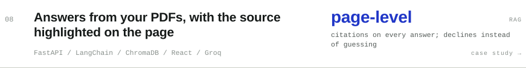</picture></a>

More agents, RAG, automation, ML systems, environmental pipelines and LLM infrastructure in [the full index](https://moosamemon.me/work/).

## How I work

**Right-sized tooling.** An n8n workflow when that's enough, a LangGraph backend when it isn't. The judgment about which one a problem deserves is the actual deliverable, not the most impressive architecture I could justify.

**Unhappy paths first.** Retries, fallbacks, evals and logging get built before the demo does. The difference between a demo and a system is everything that happens after the happy path.

**Nothing certifies itself.** Where a model can write to the real world, a human gates it, and the gate lives in the backend rather than the prompt. Where it makes a claim, the claim carries its provenance.

**Numbers or nothing.** Every write-up quotes measurements where they exist and says plainly what isn't finished. Nothing here is described as working better than it does.

## Stack

| | |
|---|---|
| **Agents and orchestration** | LangGraph · LangChain · CrewAI · MCP · n8n · Dify |
| **Models** | Claude API · Gemini · Groq · Hugging Face · ONNX Runtime · PEFT/LoRA |
| **Retrieval** | Qdrant · ChromaDB · pgvector · Pinecone · Neo4j · BM25 hybrid with RRF |
| **Backend** | FastAPI · Django · Celery · Postgres · Supabase · Redis · SQLModel |
| **ML** | PyTorch · scikit-learn · LightGBM · SHAP |
| **Frontend** | React · TypeScript · Tailwind · Astro |
| **Ops** | Docker · GitHub Actions · Prometheus · Grafana · Langfuse |

 

<a href="https://moosamemon.me/contact/">
  <picture>
    <source media="(prefers-color-scheme: dark)" srcset="assets/cta-dark.svg">
    
  </picture>
</a>

<a href="mailto:notmoosamemon@gmail.com">notmoosamemon@gmail.com</a> · <a href="https://moosamemon.me">moosamemon.me</a>

